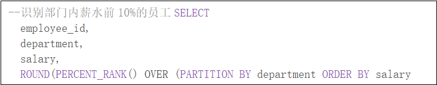
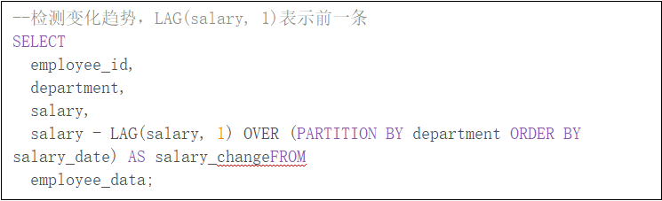
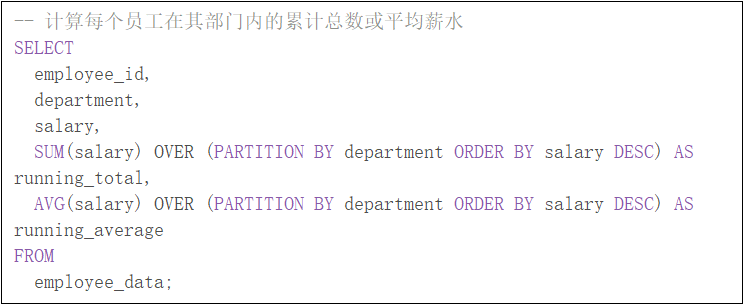
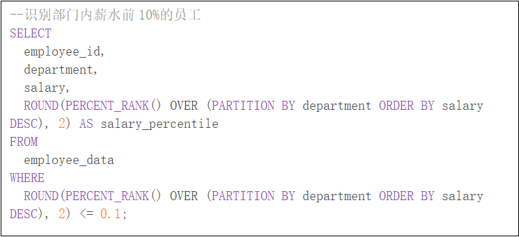

## **大数据**

### **Hadoop**

hdfs元数据表的存储方式和表结构：

NameNode的内存中有一份完整的元数据，以提高访问速度。磁盘有元数据镜像文件。表结构包含[ID、文件类型、名称、副本数、修改时间、权限、块列表]等信息。

 

窗口函数及使用场景：

窗口函数通常在Hadoop的hive和impala等工具中使用，是一种强大的数据分析工具。

 

|      |                           |
| ---- | ------------------------- |
|      |  |

 

 

 

 

|      |                           |
| ---- | ------------------------- |
|      |  |

 

|      |                           |
| ---- | ------------------------- |
|      |  |

 

 

Hadoop生态中的常用数据存储格式：

行存储适合插入，但是列多的时候，会查询多余数据、效率低

列存储适合查询，不适合插入，因为多列时，不能一次性插入

行式存储  TextFile、SequenceFile、Avro、

列式存储  ORC File、Parquet File、Arrow

 

 

Hadoop生态中的资源调度器：

 

 

### **Spark**