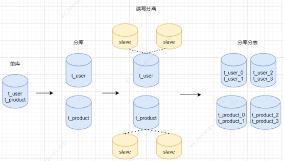
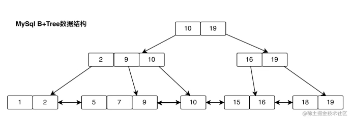

## **数据库**

### **挑战**

关系数据库的技术变迁

 

#### **全局ID问题**

分库分表以后，为了避免ID重复，不能使用自增的主键。

1、单独部署一台数据库，专门用来生成自增ID

2、雪花ID。41位的时间戳 + 10位机器ID + 12位序列号。

其中41位时间戳可以用69年，机器ID支持1024个，同一毫秒最多4096个ID（位数可自定义）

可能需要用到zookeeper来管理机器ID，避免重复

注意：ID生成器需要处理时间回拨问题

 

#### **主从延迟**

数据库做了读写分离以后，新增/修改主库数据，还没来得及同步到从库，此时查询数据，可能出现主从不一致。

解决办法：

1、强制走主库

2、Sleep方案：每次查从库之前先sleep

3、等主库位点

4、等GTID

 

详细解释一下等主库位点：

当一个事务执行完成后，我们马上发起一个查询请求，可以通过下面的步骤实现：

1. 当一个事务执行完成后，马上执行show master status 获取主库的File和Position

 

2. 选择一个从库执行查询
3. 在从库上执行 select master_pos_wait(File,Position,1)
4. 如果返回的值>=0，则在这个从库上执行
5. 否则回主库查询

 

 

 

 

#### **查询所有分区**

如果查询时没有带入分区键，可能需要查询所有分区。

比如用户表可以按user_id分区。订单表呢？用户和商户都要经常查询订单表，可以将订单表的数据按用户分区存一份，按商户分区存一份。新增订单时，发送消息给MQ给用户服务和订单服务，分别按用户维度和商户维度创建订单数据，用户维度数据按user_id分区，上午维度按merchant_id分区。

这样用户和商户都有分区键可用，而且也分担了查询压力。

 

### **其他**

#### **隔离级别**

1、读未提交

2、读已提交：保证事务里读取到的都是其他事务已经提交的数据，不保证可重复读、也可能出现幻读

3、可重复读：在事务内多次读同一数据集，返回结果保持一致，

4、串行化：通过锁定所有行，防止并发问题

 

***\*MySQL默认隔离级别为可重复读，可以解决幻读问题吗？\****

幻读是指在一个事务中，同一个查询在不同时间执行时返回不同的结果集，这通常是由于其他事务插入或删除了符合查询条件的行所导致的。

***\*快照读与当前读\****

在可重复读隔离级别下，MySQL通过多版本并发控制（MVCC）机制来避免幻读。MVCC通过在事务开始时创建一个读视图（Read View）来保证事务在执行过程中看到的数据一直是一致的。这种读取历史数据的方式称为快照读（Snapshot Read）。例如，即使在事务执行期间有新的数据被插入，这些数据也不会出现在事务的查询结果中。

对于需要修改数据的操作（如UPDATE、INSERT、DELETE），MySQL采用当前读（Current Read）的方式。这意味着这些操作会读取并锁定最新版本的数据。

***\*Next-Key Locks\****

为了解决当前读可能引起的幻读问题，InnoDB引入了Next-Key Locks，这是一种结合了记录锁（Record Lock）和间隙锁（Gap Lock）的锁机制。当一个事务通过SELECT ... FOR UPDATE对数据加锁时，它实际上锁定了索引记录和索引记录之间的间隙。这样，如果有其他事务试图在这个范围内插入数据，它将被阻塞，从而避免了幻读问题。

***\*幻读的特殊情况\****

尽管可重复读隔离级别在很大程度上避免了幻读，但仍有特殊情况下幻读无法完全避免。例如，如果一个事务在没有立即执行SELECT ... FOR UPDATE的情况下先进行了快照读，然后在这期间其他事务插入了新记录，那么当事务后续使用当前读进行查询时，就可能发现两次查询的结果不一致，从而发生幻读。

***\*解决方案\****

要彻底避免幻读，可以采取以下措施：

1、将隔离级别提升到串行化（Serializable），这将通过加锁来避免幻读，但会显著影响性能。

2、在事务开始后尽快执行SELECT ... FOR UPDATE或其他当前读语句，以便立即对必要的数据加锁。

 

***\*Oracle默认隔离级别为读已提交，如何解决不可重复读及幻读问题？\****

Oracle只支持读已提交和序列化两种隔离级别

可以通过SELECT...FOR UPDATE来实现可重复读的效果

### **MySQL**

#### **底层数据结构**

 

MySQL中，B+树是InnoDB存储引擎使用的数据结构，用于组织和管理索引。

1 叶子节点组成双向列表，用于解决范围查询和顺序访问，叶子节点既存储键值，也存储数据（聚簇索引）

2 非叶子节点只存索引，指向子节点的最大/最小值

3 树是平衡的

#### **索引类型**

索引分为聚簇索引和二级索引，它们都使用B+树存储

 聚簇索引是主索引，在InonoDB中，每张表的数据都按主键顺序存储，即表的数据是按照B+树结构组织的。

 二级索引是除了主键以外的其他索引，用来加速非主键列的查询。二级索引的B+树的叶子节点存储的是列的值和对应的主键值。当使用二级索引查询时，先通过二级索引找到主键值，再通过主键去聚簇索引的B+树查找实际的数据行

#### **索引失效**

1 使用 or 查询且不是每个条件都有索引

2 使用负向条件 not in、!=，索引只支持精确匹配或者范围查找

3 like 查询以 % 打头，%部分为未知，无法匹配索引

4 对索引列进行函数操作，因为索引是基于原始值

5 多列索引时，不支持最左前缀原则

#### **性能优化**

**查询优化**

1 复杂子查询优化，比如exists语句，主查询的每一行都要做一次子查询，可以改为关联查询

SELECT name FROM users u WHERE EXISTS (SELECT 1 FROM orders o WHERE o.user_id = u.id);

2 避免主查询 select *，只返回需要的数据，减少传输量，优化查询性能

3 使用索引，减少数据扫描量

**表结构优化**

1 避免外键约束，因为会增加锁定和写入成本

2 增加索引

**缓存优化**

频繁读取的变化少的数据，可以考虑使用外部缓存系统

**事务和锁优化**

长事务会阻塞其他查询，尽量缩短事务执行时间

**读写分离**

通过主从复制实现读写分离，减少主库的查询压力

**硬件优化**

1 虚拟机换成物理机

2 增加内存

3 硬盘换成SSD

**定期维护**

1 定期对数据归档，提升查询性能

2 定期分析慢SQL

3 定期监控磁盘、CPU的资源使用

#### **分片**

ShardingSphere

#### **分布式事务**

##### **最终一致性**

 主节点完成数据写入后，发送事件到MQ通知从节点，从节点收到通知完成数据写入并通知主节点。

 从节点写入失败，可以进行重试

 从节点多次重试依然失败，可以回滚，并发送通知给主节点

 主节点回滚

#### **锁**

l 悲观锁：适合高冲突场景

l 乐观锁：即MVCC，支持更高的并发，事务开始时创建新版本，不锁定数据，事务提交时校验版本，版本跟预期一致，即数据没有修改则事务提交成功，否则提交失败