## **系统设计**

### **设计模式**

设计模式，往小了看，可以设计一个功能类，往大了说，可以帮你设计系统结构

#### **创建型**

单例模式

原型模式：复制/克隆已有对象

生成器模式（Builder）：分步骤创建复杂对象

工厂方法模式：父类提供创建对象的方法，子类提供具体实现。

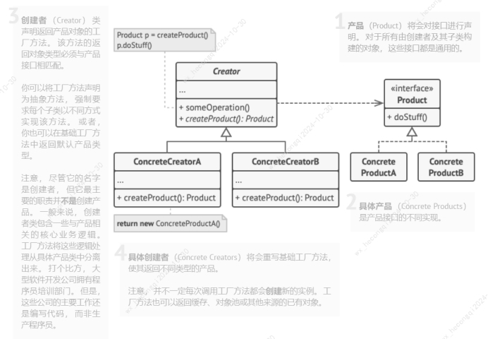 

抽象工厂模式：与工厂方法相比，抽象工厂会创建多个产品，具体工厂代表具体风格，或者叫做一个系列

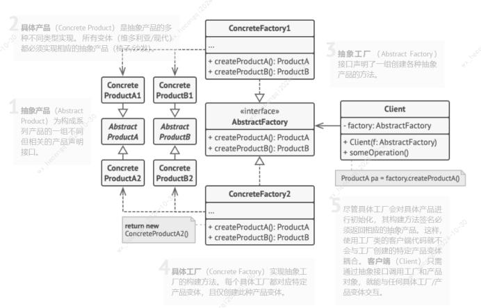 

#### **结构型**

适配器模式：使接口不兼容的对象相互合作，Client只能调Client Interface接口的实现类，但又需要Service的能力，Adapter完美实现适配

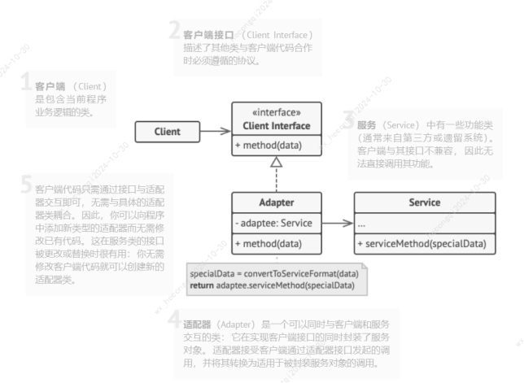 

l 桥接模式：将继承改为组合，抽取某个维度成为独立的类层次。考虑如下场景，可以给每个设备都设计一个遥控机，也可以只设计一个遥控器，在遥控器里引入设备对象。

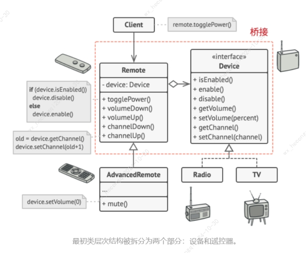 

l 组合模式：所有元素共用一个接口，适合树状结构对象

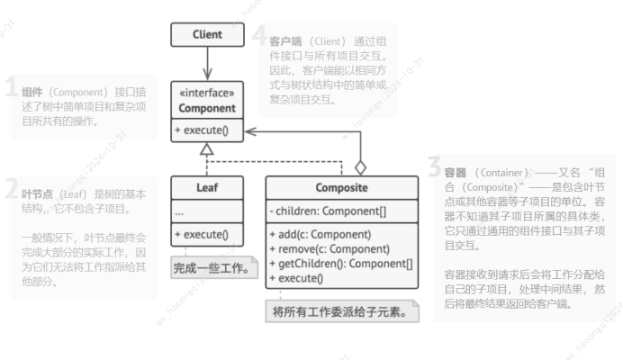 

l 装饰模式：不更改对象，同时增加行为

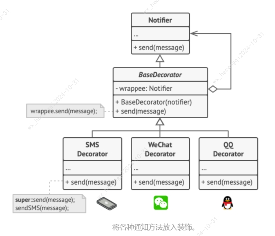 

l 外观模式：封装复杂功能，提供简单接口调用

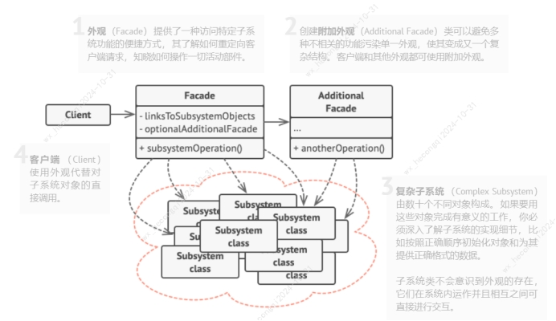 

l 享元模式

共享数据，节约内存

Tree.java: 包含每棵树的独特状态
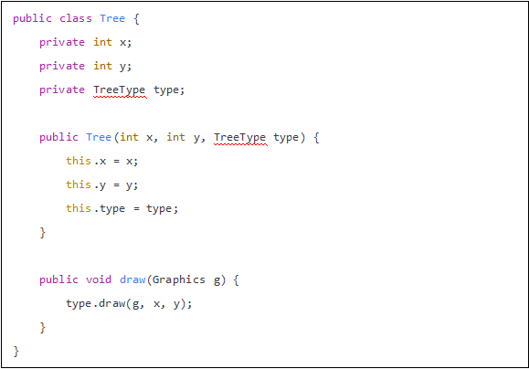

TreeType.java: 包含多棵树共享的状态
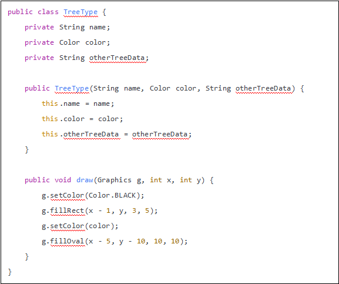

TreeFactory.java: 封装创建享元的复杂机制
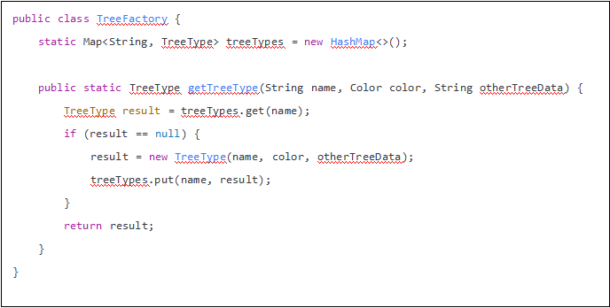

 

l 代理模式

代理与适配器模式不同，下图中Proxy与Service都是ServiceInterface的子类，而适配器是为了解决接口的不相容问题。
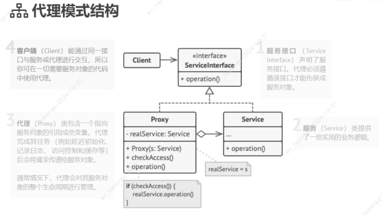 

#### **行为型**

l 责任链模式：请求通过责任链依次处理

l 命令模式：将请求转换为对象， 可放入队列，实现延迟执行。
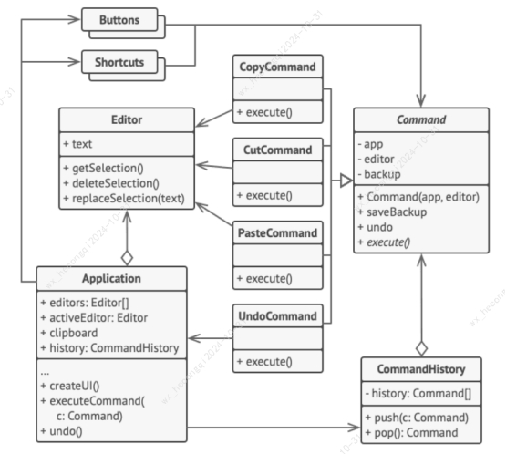 

l 迭代器模式：不暴露底层数据（列表、树、图），却能遍历所有元素，比如树可以深度优先遍历或者广度优先遍历
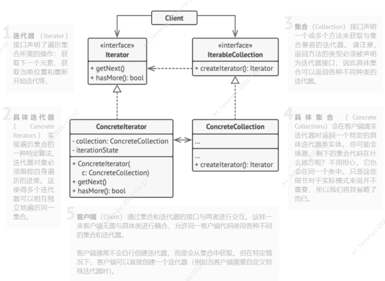 

l 备忘录模式

备忘录即备忘的目录，备忘即快照，目录即列表
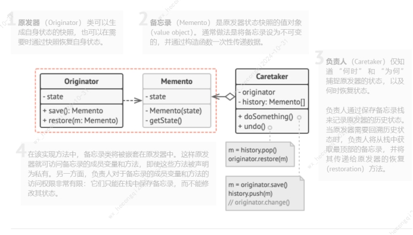 

l 观察者模式
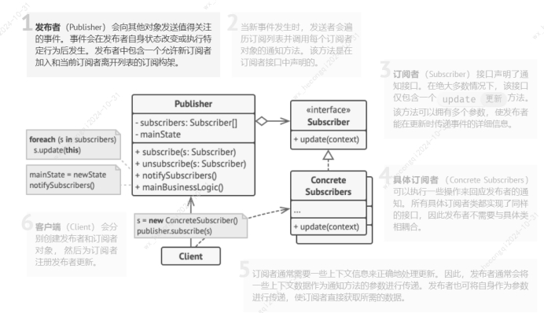 

l 状态模式

将状态变化逻辑抽取到状态类，简化代码。

l 策略模式

定义一系列算法， 并将每种算法分别放入独立的类中， 以使算法的对象能够相互替换

l 模版方法模式

它在超类中定义了一个算法的框架， 允许子类在不修改结构的情况下重写算法的特定步骤。

l 访问者模式

将算法与其所作用的对象隔离开。

 

### **分布式**

#### **分布式事务**

数据库做了分库，或者业务系统做了服务拆分以后，跨库或者跨服务的调用如果需要保证一致性，就需要分布式事务了。

##### **两阶段提交**

包含两个角色：分布式事务协调者（coordinator）和N个参与者（participant）

第一阶段：准备，第二阶段：提交

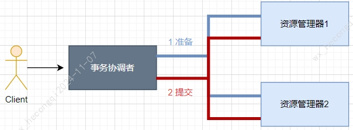 

在准备阶段，会开启事务，并写入Redo和Undo日志，但不提交事务。

问题：

性能问题：准备阶段需要全部参与者执行完，才可进入提交阶段，期间一直占用资源。

事务协调者单点故障问题。

##### **三阶段提交**

在两阶段的准备阶段之前增加询问阶段，全部参与者反馈OK后，再进入准备阶段

##### **TCC模式**

Try-confirm-cancel，类似两阶段提交

##### **SEATA框架**

SEATA是阿里开源的分布式事务解决方案，包括AT、TCC、XA模式等

###### **AT模式**

Auto Transcation。它是非侵入的，适合支持本地事务的关系数据库，数据源代理类（DataSourceProxy）会完成分布式事务的大部分工作。整体也分两阶段，可实现写隔离、读隔离。

一阶段：提交事务、释放资源锁

二阶段：通过一阶段Undo日志回滚

如下图全局事务 tx1：

一阶段：先开始本地事务、获取全局锁、提交本地事务、释放本地锁。

二阶段：全局事务提交、释放全局锁

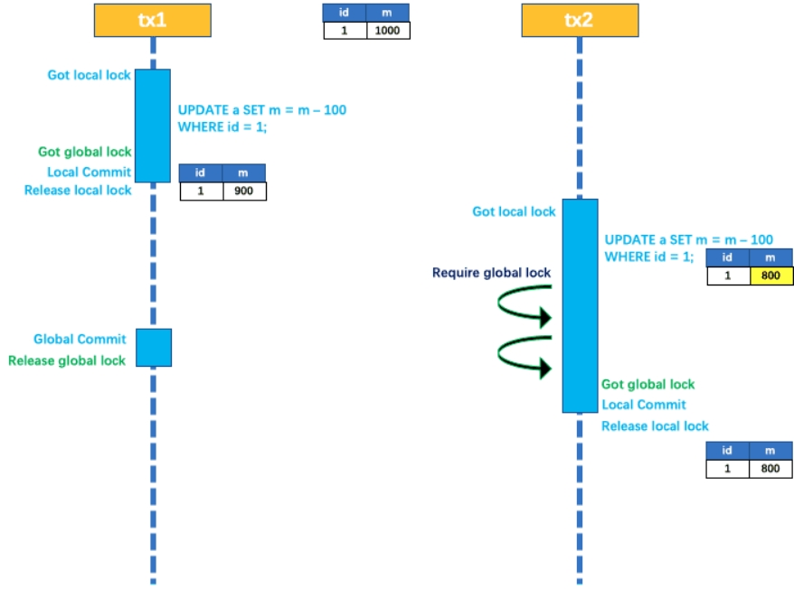 

下图全局事务tx1中，本地事务回滚需要获取本地锁。

下图全局事务tx2中，在本地事务开始后、提交前，获取全局事务失败，会触发本地事务回滚。

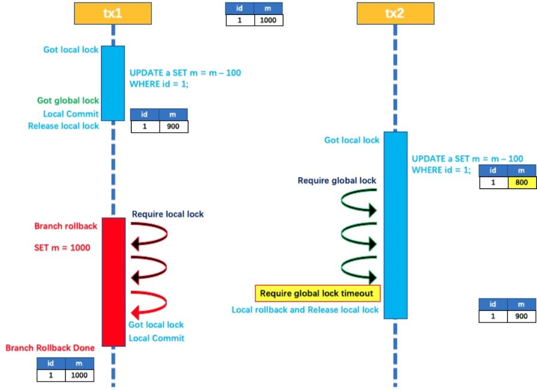 

 

###### **TCC模式**

Try-Confirm-Cancel。它是侵入式的，不依赖底层数据库资源的，需要自定义实现prepare、commit、rollback的模式，比较复杂。

TCC 的 Try 操作作为一阶段，负责资源的检查和预留；Confirm 操作作为二阶段提交操作，执行真正的业务；Cancel 是二阶段回滚操作，执行预留资源的取消，使资源回到初始状态。

###### **XA模式**

它是X/Open组织定义分布式事务处理标准。它要求数据资源提供对规范和协议的支持，和AT模式一样，它是非侵入式的，且主流数据库广泛支持。

缺点：

XA prepare 后，分支事务进入阻塞阶段，收到 XA commit 或 XA rollback 前必须阻塞等待。事务资源长时间得不到释放，锁定周期长，而且在应用层上面无法干预，性能差。

 

#### **分布式算法**

##### **一致性哈希**

背景：

如何将缓存数据均匀存放到3台服务器，最简单的办法是对数据做哈希运算并取模：hash(key)/N，但是如果缓存服务器需要动态扩容，那么所有数据都要重新计算调整，进而导致所有缓存同一时间不可用，造成缓存雪崩，这是不可接受的。

简介：

一致性哈希的目的就是解决分布式系统的数据分区问题，当增加或者移除一个服务器时，必须尽可能小的减少服务请求与处理请求的服务器之间的映射关系。

使用场景有关系数据库的分库分表，解决数据与节点的映射关系；缓存服务器的数据分区。

算法原理：

取模算法是按服务器数量取模，一致性哈希算法是对固定值2^32取模，不管集群中有多少个节点，只要key值固定，那么请求的服务器节点也是固定的。原理如下：

1、一致性哈希算法将整个哈希值空间映射成一个虚拟的圆环，整个哈希空间的取值范围为0~2^32-1。

2、计算各服务节点的哈希值，并映射到哈希环上。

3、将服务请求使用哈希算法算出哈希值，并映射到哈希环上，同时沿着圆环顺时钟查找，遇到的第一台服务器就是处理请求服务器。

4、当增加或者删除一台服务器时，影响范围为增加或删除服务器到环空间中前一台服务器（逆时钟遇到的第一台服务器）之间的数据，其他数据不受影响。

综上所述，一致性哈希算法对于节点增减只需重定位环空间中很少一部分数据，具有较好的性能。

数据倾斜：

集群节点太少时，可能出现大多数访问请求都集中在少量几个节点的情况，导致节点的负载不均匀。

虚拟节点：

为了解决数据倾斜的问题，一致性哈希算法引入了虚拟节点机制，即每个物理节点映射多个虚拟节点。将虚拟节点计算哈希值并映射到哈希环上，当请求找到某个虚拟节点后，将被重新映射到具体的物理节点，虚拟节点越多，哈希环上的节点就越多，数据分布就越均匀，从而避免了数据倾斜。

### **其他**

#### **幂等性**

无论是数据库层面、业务层面、系统层面，涉及到变更的操作都要考虑幂等性。

幂等性，可以拆解为两个动作：判断和执行，先判断再执行，判断符合条件才能执行。比如Redis的setnx命令，先判断是否存在key，不存在则设置key

如订单支付，先判断订单状态，如果未支付，才能进行支付