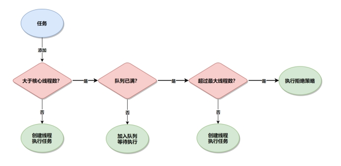

## **编程语言**

### **Java**

#### **多线程**

##### **线程池参数**

核心线程数、最大线程数、最大存活时间、时间单位、线程工厂、阻塞队列、拒绝策略。

任务处理流程：

1 等待提交任务

 2.1 当前线程数小于核心线程数，即使有空闲的线程，也会创建线程处理任务，break(结束第2步)

 2.2 当前线程数大于核心线程数，则先放入阻塞队列

 2.3 如果阻塞队列未满，且运行线程数小于最大线程数，则等待核心线程空闲再执行，所以无界队列线程数不会超过核心线程数

 2.4 如果阻塞队列满了，且运行线程数小于最大线程数，则创建非核心线程运行任务

 2.5 如果阻塞队列满了，且运行线程数大于最大线程数，则执行拒绝策略

3 当一个线程完成任务后，它会从队列取下一个任务执行

4 当一个线程无事可做超过最大存活时间时，如果当前线程数超过核心线程数，会销毁线程

 

##### **并发场景**

并发可以利用多核的能力，让一个CPU同时处理成千上万个IO任务，并发适合IO密集型任务，因为IO处理比较慢，在等待IO完成期间可以释放CPU用于其他任务。

http请求线程池、定时任务工作线程池。

发送邮件、短信的线程池：

生成Excel、word文档的线程池：

需要用户界面快速响应的线程池，避免界面冻结

 

##### **synchronized关键字**

锁静态方法和锁普通方法的区别：

当一个静态方法被声明为synchronized时，锁定的是当前类的class对象。因为class对象是唯一的，所以这个锁也是全局的，所有实例共享同一个锁。这意味着同一时间，只有一个线程可以执行该类的任何synchronized static方法。

当一个普通方法被声明为synchronized时，锁定的是实例对象。这意味着同一时间，一个实例对象上的所有synchronized方法只能被一个线程访问。每个实例都有自己的锁，所以不同实例可以同时执行它们个字的synchronized方法

##### **锁**

**1 内置锁（synchronized）**，每个对象都有一个内置的监视器锁，当一个线程进入同步块或者方法时，它会获得对象的锁，其他线程必须等待，直到该线程释放锁后，才能获取锁。

包括对象级锁、类级锁

内置锁的特点：具备重入锁特性，即一个线程已经获得某个锁，它可以再次获得相同的锁

**2** **重入锁（ReentrantLock）**

l 可重入

l 支持尝试获取锁 tryLock，如果锁不可用不阻塞线程

l 支持中断 tryInterruptibly() ,线程在等待锁时可以响应中断

l 支持超时获取锁，线程可以设置最长等待时间

重入锁相比内置锁提高了灵活性，还支持非阻塞、设置等待时间功能

**3 读写锁（ReadWriteLock）**

允许多个线程同时获得读锁，只允许一个线程获得写锁

读写锁相比重入锁，增加了读写的区分能力，适合读多写少的场景

**4 StampedLock**

不仅支持读写锁，还支持乐观读，先不加锁，事后校验。在读写锁的基础上，进一步提高了性能

##### **线程通信**

1、共享对象，一个线程修改对象状态，领一个线程读取这个状态。

2、等待和通知，调用对象的wait方法会释放持有的对象锁并阻塞等待，调用对象的notify方法会通知对象的阻塞线程，但被通知的线程不能立即执行，必须等当前线程释放锁后，被通知的线程才能尝试重新获取锁并继续执行。

3、Join，一个线程等待另一个线程完成

4、CountDownLatch，主线程等待子线程完成，通过计数器实现，计数器的值在每次操作完成时递减，直到计数器为0零

5、锁，synchronized关键字和Lock可以控制只有一个或者部分线程可以执行同步代码

6、Semaphore，是一种并发控制工具，用于控制对共享资源的访问（acquire()方法），确保不超过一定数量的线程（许可数量）可以同时访问资源，如果许可证不足，则线程会被阻塞，当线程释放资源后，会释放许可证（release）

7、CyclicBarrier，它允许一组现场相互等待，直到所有线程都到达某个屏障点（所有线程都调用await()方法），这些线程才能继续执行后续任务

 

##### **线程安全**

线程安全的目的是确保在并发环境下，程序的行为是正确的。

1、同步synchronized，确保同一时间只有一个线程可以执行同步代码块

2、Lock，比同步关键字更灵活

3、Condition，条件变量与Lock配合使用，用来等待和通知特定条件的发生

4、使用不可变对象，如String，Collections.unmodifiableList/Set/Map

5、使用原子变量，支持无锁的线程安全操作。底层基于硬件支持的CAS，比较Compare和更新Set之间没有其他现成干扰，原子变量可以看做一种乐观锁策略，即假设大多数情况下，变量的值不会被其他线程修改，只在确实发生冲突时重试。如果高并发导致CAS失败次数太多，可能会有性能问题。

6、正确处理异常，确保异常发生时，锁能够被释放，避免死锁

7、最小化同步的范围，只对必要代码进行同步，减少同步带来的性能开销

##### **ThreadLocal**

ThreadLocal 是 Java 提供的一种线程局部变量机制，它允许在多线程环境下，每个线程都拥有自己的变量副本，避免了变量的共享问题。使用场景包括：

***\*1、事务管理：\****在处理事务时，每个线程可能需要维护自己的事务状态。ThreadLocal 可以用来存储每个线程的事务信息，如事务ID、回滚标志等

***\*2、用户会话信息\****：在Web应用中，每个用户请求可能需要维护自己的会话信息。使用 ThreadLocal 可以存储当前请求的用户信息、权限等

***\*3、日志记录\****：在多线程环境中，日志记录可能需要包含线程特定的信息，如线程ID或请求ID。ThreadLocal 可以用来存储这些信息，以便在日志记录时使用

***\*4、统计信息\****：在性能监控或调试时，可能需要收集每个线程的统计信息，如执行时间、执行次数等。ThreadLocal 可以用来存储这些统计数据

 

##### **线程池的关闭**

***\*线程中断（Interrupt）\****

主线程调用子线程的Thread.interrupt()方法后，子线程如果在Object类的wait方法或Thread类的join、sleep方法中被阻塞，它将收到InterruptedException。子线程如果在IO操作中阻塞，它将收到IO相关异常。子线程如果未阻塞，则只是设置中断状态，并不影响子线程的运行。

所以线程要在适当的位置通过调用isInterrupted方法来查看自己是否被中断，并做退出操作。

***\*线程池的关闭\****

线程池有两个关闭方法：shutdownNow和shutdown，调用完关闭方法后，并不代表线程池已经完成关闭操作，它只是异步的通知线程池进行关闭处理。如果需要同步等待线程池彻底关闭后才继续往下执行，需要调用awaitTermination方法进行同步等待。

无论shutdown还是shutdownNow，线程池都会拒绝接收新提交的任务。

调用shutdown方法后，会遍历线程池的所有工作线程，当线程没有正在执行时，则调用线程的Interrupt方法。如果线程正在执行，即便处于阻塞状态，线程也不会被中断，而是继续执行。如果线程池阻塞等待从队列里读取任务，则会被唤醒去从队列里读取任务执行。

调用shutdownNow方法后，会遍历线程池的所有工作线程，并调用线程的Interrupt方法，那么如果线程正在IO阻塞，则会导致异常报错。如果线程正在正常执行，则不受影响，继续执行完这个任务。如果线程处于从队列读取任务而阻塞，那么它会放弃获取任务。

#### **JVM**

##### **内存结构**

***\*堆\****：线程共享，存储对象实例

***\*永久代/元空间\****：存储类结构

***\*栈\****：线程私有，存放局部变量表、程序计数器

 

##### **full gc**

触发条件：老年代空间不足、老年代连续空间不足、分配担保失败、永久代/元数据空间不足、System.gc()的显示调用

 

#### **其他**

##### **内存泄漏**

内存泄漏（Memory Leak）是指在计算机程序中，已分配的内存空间在不再使用后，由于某种原因没有被正确地释放回内存池，导致这部分内存无法被再次使用的现象。内存泄漏并不是指内存的物理损坏，而是指程序在申请内存后，无法释放已经申请的内存空间。

连接泄漏：数据库连接、网络连接、文件流在使用后没有正确关闭，导致这些资源无法释放，可能导致内存泄漏。

### **开发框架**

#### **Spring基础**

##### **容器初始化过程**

1 创建容器，比如 AnnotationConfigApplicationContext

2 读取注解，扫描类路径

3 Bean 定义的解析，并加载到注册表

4 Bean 的实例化

5 依赖注入，通过构造器注入或者属性注入，将依赖对象注入到 Bean 实例

6 初始化回调

7 完成初始化，开始提供服务

##### **Bean生命周期**

1 通过反射机制实例化 Bean 对象

2 设置属性/依赖注入

3 Aware 接口回调，可以感知到容器，将容器信息传递给 Bean

4 BeanPostProcessor，如果容器有的话，调用它的 before 方法

5 初始化，如调用 init method 方法

6 BeanPostProcessor，如果容器有的话，调用它的 after 方法

7 Bean 完成初始化，可以使用

8 销毁及回调

9 销毁完成

Q1：BeanFactoryAware、ApplicationContextAware 回调时，我想通过容器对象访问其他Bean，但其他Bean可能还没有创建，怎么办？

A1：没关系，通过BeanFactory.getBean获取Bean的时候，如果Bean还没创建好，Spring会自动创建。

 

Q2：Spring如何解决Bean的循环依赖？

A2：Spring允许循环依赖，如A依赖B，B依赖A。Spring在初始化A的时候，因为A依赖B，就去初始化B，B又依赖A，Spring会创建半成品的A，B依赖注入半成品A，B创建完成，A依赖注入B，结束。

##### **AOP**

基本概念：

 切面（Aspect）：封装横切关注点，包括通知和切点。在实际应用中，切面是一个类，包含通知逻辑。

 连接点（Join Point）：程序执行过程中的一个点，AOP可以在这些点上插入代码。

 切点（Pointcut）：切点指那些你想增强的地方，通常定义为一组连接点。

 通知（Advice）：通知是AOP中的增强操作，有前置、后置、环绕、返回、异常通知。其中环绕通知可以中断目标方法的执行

 目标对象：被切面增强的对象，SpringAOP通过动态代理将增强逻辑添加到目标对象的方法中。

 代理：增强后的对象，SpringAOP通过动态代理生成目标对象的代理类，通过代理执行增强后的逻辑

 

#### **SpringBoot**

##### **优点**

 简化配置，减少甚至提供默认配置

 生态完整，基于Spring框架，集成了SpringMVC，还内置日志、消息、数据源组件

 内嵌服务器，实现轻量级部署

 与SpringCloud集成，便于构建微服务

##### **应用启动过程**

1 SpringBoot应用由main方法启动，调SpringApplication.run引导应用的启动过程

2 加载环境变量，读取配置文件、命令行参数

3 设置应用监听器

4 创建ApplicationContext，扫描注解类，注册成Bean；扫描自动配置类，通过配置条件自动注入Bean

5 启动内嵌的Web容器，将Controller注册到Web容器

6 调用实现了ApplicationRunner接口的Bean

7 应用启动完成

Q：简单介绍下SpringBoot的自动配置/自动装配

A：

-@SpringBootApplication注解复合了@EnableAutoConfiguration注解，隐式启动了自动配置注解。

-模块包的META-INF目录下有spring.factories文件列出了所有自动配置类。

-自动配置类通过条件注解自动注入Bean，如@ConditionOnClass，@ConditionOnMissingBean等。

-条件注解就是满足条件后才会自动注入Bean

#### **Mybatis**

##### **分页**

分页有两种实现方式：直接在SQL分页、通过分页插件分页。前者会跟具体数据库绑定，还需手动查询数据总条数。后者以PageHelper为例进行介绍.

只需在项目里增加PageHelper的Maven依赖、增加方言配置，然后按如下demo调用即可。

```java
PageHelper.startPage(pageNum,pageSize);
List<Product> list = productDao.selectByName(name);
PageInfo page = new PageInfo<>(list);
```